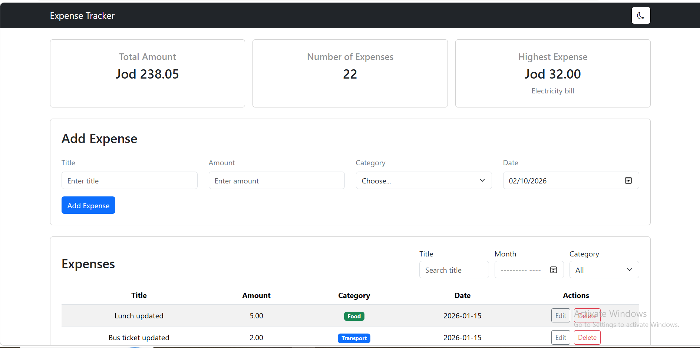
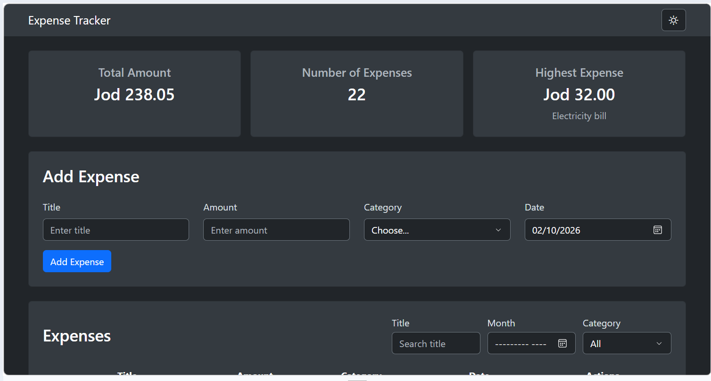
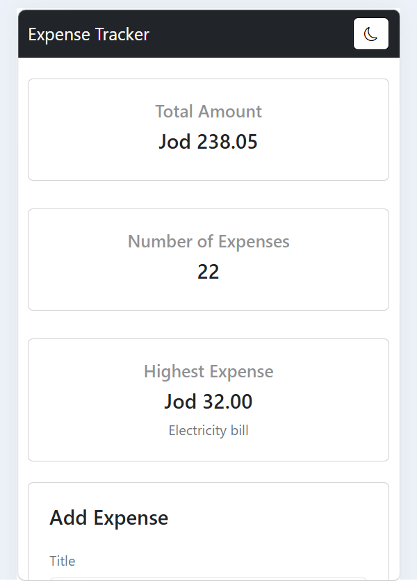

# Expense Tracker

A full-stack web application for managing expenses. The application retrieves expense data from the backend API and allows users to add, edit, delete, and filter expenses by category, month, and title. It also includes summary cards showing the total amount, number of expenses, and highest expense, along with a dark mode for a better user experience.

## How to run

**Backend**
1. Open the project folder in VS Code.
2. Open PostgreSQL/pgAdmin and create a database named `expense_tracker`.
3. Run the `schema.sql` file in the database.
4. Create a `.env` file in the backend folder and add your PostgreSQL connection settings based on `.env.example`.
5. Open the terminal and navigate to the backend folder:
   `cd backend`
6. Install the required packages:
   `npm install`
7. Start the backend server:
   `node server.js`
8. Make sure the backend server is running before opening the frontend.

**Frontend**
1. Install the **Live Server** extension in VS Code.
2. Open the `index.html` file in VS Code.
3. Right-click on `index.html` and select **Open with Live Server**.

## Features

- [x] Get expenses from the PostgreSQL database
- [x] Add an expense (with validation)
- [x] Delete an expense
- [x] Edit an expense
- [x] Filter by category
- [x] Summary cards (total, count, highest)
- [x] Data is saved in a PostgreSQL database
- [x] Bootstrap spinner and alerts
- [x] Responsive design
- [x] Filter by month
- [x] Filter by title
- [x] Dark Mode

## Screenshots

## What was the hardest part?

The hardest part was connecting the frontend with the backend and understanding how fetch requests communicate with the API and PostgreSQL database. At first, handling the requests, responses, and validation was challenging. I solved these challenges by testing each feature step by step and checking the requests and responses carefully.

## Video Link:
https://drive.google.com/file/d/1pXyX3hNZOXs0mB7F5gx0DAox62DRScbJ/view?usp=drive_link

## GitHub Repository:
https://github.com/galyahikbariyeh/First-Project--Expense-tracker.git

## Live Project
https://galyahikbariyeh.github.io/First-Project--Expense-tracker/

